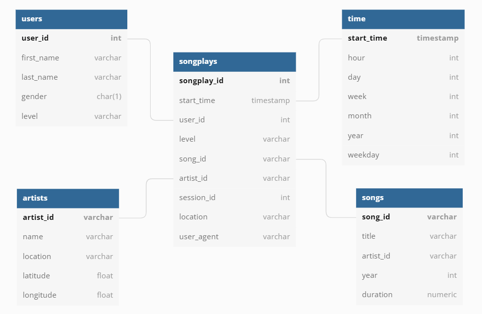

<h1 align="center"> Data Modeling ETL with Postgres </h1>

## Project Description
A startup called Sparkify wants to analyze the data they've been collecting on songs and user activity on their new music streaming app. The analytics team is particularly interested in understanding what songs users are listening to. Currently, they don't have an easy way to query their data, which resides in a directory of JSON logs on user activity on the app, as well as a directory with JSON metadata on the songs in their app.

In this project, I created a database schema, and data modeling with Postgres and ETL pipeline using Python for this analysis. To complete the project, it needed to define fact and dimension tables for a star schema for a particular analytic focus, and write an ETL pipeline that transfers data from files in two local directories into these tables in Postgres using Python and SQL. It can test the database and ETL pipeline by running queries given by the analytics team from Sparkify and comparing results with their expected results.

## Dataset
- Song Dataset

The first dataset is a subset of real data from the [Million Song Dataset](http://millionsongdataset.com/). Each file is in JSON format and contains metadata about a song and the artist of that song.

Sample Song Data:
```
{
    "num_songs":1,
    "artist_id":"ARBGXIG122988F409D",
    "artist_latitude":37.77916,
    "artist_longitude":-122.42005,
    "artist_location":"California - SF",
    "artist_name":"Steel Rain",
    "song_id":"SOOJPRH12A8C141995",
    "title":"Loaded Like A Gun",
    "duration":173.19138,
    "year":0
}
```
- Log Dataset

The second dataset consists of log files in JSON format generated by this [event simulator](https://github.com/Interana/eventsim) based on the songs in the dataset above. These simulate activity logs from a music streaming app based on specified configurations.

Sample Log Data:
```
{
    "artist":"Fall Out Boy",
    "auth":"Logged In",
    "firstName":"Ryan",
    "gender":"M",
    "itemInSession":1,
    "lastName":"Smith",
    "length":200.72444,
    "level":"free",
    "location":"San Jose-Sunnyvale-Santa Clara, CA",
    "method":"PUT",
    "page":"NextSong",
    "registration":1541016707796.0,
    "sessionId":169,
    "song":"Nobody Puts Baby In The Corner",
    "status":200,
    "ts":1541109125796,
    "userAgent":"\"Mozilla\/5.0 (X11; Linux x86_64) AppleWebKit\/537.36 (KHTML, like Gecko) Ubuntu Chromium\/36.0.1985.125 Chrome\/36.0.1985.125 Safari\/537.36\"",
    "userId":"26"
}
```

## Database Schema 


## Project Structure

|  File / Folder   |                         Description                          |
| :--------------: | :----------------------------------------------------------: |
|    data.zip      |               All song and log data JSONS                    |
| create_tables.py |                  Drops and creates tables                    |
|  sql_queries.py  |            SQL queries for data modeling and ETL             |
|    etl.ipynb     | Processes a file from song_data and log_data and loads the data into tables |
|      etl.py      | Processes all files from song_data and log_data and loads them into  tables |
|    test.ipynb    |                Explores the database tables                 |


## How to Run Python Scripts

To create the database tables and run the ETL pipeline, you must run the following two files in the order that they are listed below

To create tables:
```
python create_tables.py
```
To fill tables via ETL:
```
python etl.py
```
To check whether the data has been loaded into database by executing queries:
```
test.ipynb
```
Run ```create_tables.py``` file to reset tables before each time run your ETL scripts.

## Author
Burcu Belen - [Linkedin](https://www.linkedin.com/in/burcu-belen/)
